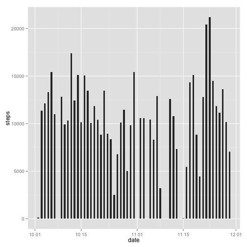
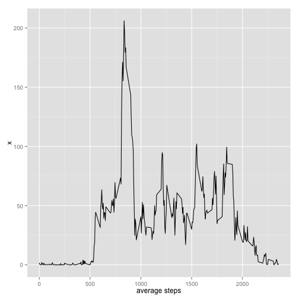

Reproducible Research: HW1
==========================================

### Loading and preprocessing the data


```r
echo = TRUE
obj_csv <- read.csv("activity.csv")
obj_csv$date <- as.Date(obj_csv$date, format="%Y-%m-%d")
obj_clean <- na.omit(obj_csv)
```

### What is mean total number of steps taken per day?
(For this part of the assignment, you can ignore the missing values in the dataset.)

* Make a histogram of the total number of steps taken each day


```r
qplot(date, steps, data = obj_clean, stat="identity", geom = "histogram", width = 0.5)
```

 
* Calculate and report the mean and median total number of steps taken per day


```r
agr_steps <- aggregate(obj_clean$steps, list(Date = obj_clean$date), FUN = "sum")$x
mean(agr_steps)
```

```
## [1] 10766.19
```

```r
median(agr_steps)
```

```
## [1] 10765
```

### What is the average daily activity pattern?

* Make a time series plot of the 5-minute interval (x-axis) and the average number of steps taken, 
  averaged across all days (y-axis)


```r
avg <- aggregate(obj_clean$steps, list(interval = as.numeric(as.character(obj_clean$interval))), FUN = "mean")
qplot(interval, x, data = avg, stat="identity", geom = "line", xlab = "average steps")
```

 
* Which 5-minute interval, on average across all the days in the dataset, contains the maximum number of steps?


```r
avg[avg$x == max(avg$x),]
```

```
##     interval        x
## 104      835 206.1698
```

### Imputing missing values
Note that there are a number of days/intervals where there are missing values (coded as NA). 
The presence of missing days may introduce bias into some calculations or summaries of the data.

* Calculate and report the total number of missing values in the dataset 
  (i.e. the total number of rows with NAs)

```r
sum(is.na(obj_csv))
```

```
## [1] 2304
```
* Devise a strategy for filling in all of the missing values in the dataset. 
  The strategy does not need to be sophisticated. 
  For example, you could use the mean/median for that day, or the mean for that 5-minute interval, etc.

Here, we are going to use the "mean for the 5-minute interval" to fill the missing part!

```r
obj_csv2 <- obj_csv
for(i in 1:nrow(obj_csv2)){
	if(is.na(obj_csv2$steps[i])){
		obj_csv2$steps[i] <- avg[which(obj_csv2$interval[i] == avg$interval), ]$x
	}
}
```
Checking there are no more missing values


```r
sum(is.na(obj_csv2))
```

```
## [1] 0
```

* Make a histogram of the total number of steps taken each day 
  and Calculate and report the mean and median total number of steps taken per day.


```r
qplot(date, steps, data = obj_csv2, stat="identity", geom = "histogram")
```

 

* Do these values differ from the estimates from the first part of the assignment? 
  What is the impact of imputing missing data on the estimates of the total daily number of steps?


```r
agr_steps2 <- aggregate(obj_csv2$steps, list(Date = obj_csv2$date), FUN = "sum")$x
mean(agr_steps2)
```

```
## [1] 10766.19
```

```r
median(agr_steps2)
```

```
## [1] 10766.19
```

To make sure if there is anything changed.
From the information bellow, we know that the means are still the same,
but the median becomes bigger!


```r
mean(agr_steps2) == mean(agr_steps)
```

```
## [1] TRUE
```

```r
median(agr_steps2) == median(agr_steps)
```

```
## [1] FALSE
```

```r
median(agr_steps2) - median(agr_steps)
```

```
## [1] 1.188679
```

### Are there differences in activity patterns between weekdays and weekends?
* Create a new factor variable in the dataset with two levels – “weekday” and “weekend” 
  indicating whether a given date is a weekday or weekend day.
  (We have no choice but use a little bit Chinese here, since it is a RStudio of Chinese version...)


```r
obj_csv2$weekdays <- factor(format(obj_csv2$date, "%A"))
levels(obj_csv2$weekdays)
```

```
## [1] "周二" "周六" "周日" "周三" "周四" "周五" "周一"
```

```r
levels(obj_csv2$weekdays) <- list(weekday = c("周一", "周二", "周三", "周四", "周五"),
                                   weekend = c("周六", "周日"))
avg2 <- aggregate(obj_csv2$steps, list(interval = as.numeric(as.character(obj_csv2$interval)), weekdays = obj_csv2$weekdays), FUN = "mean")
```
* Make a panel plot containing a time series plot of the 5-minute interval (x-axis) 
  and the average number of steps taken, averaged across all weekday days or weekend days (y-axis).


```r
library(lattice)
xyplot(avg2$x ~ avg2$interval | avg2$weekdays, layout = c(1, 2), type = "l", xlab = "Interval", ylab = "Steps")
```

 


